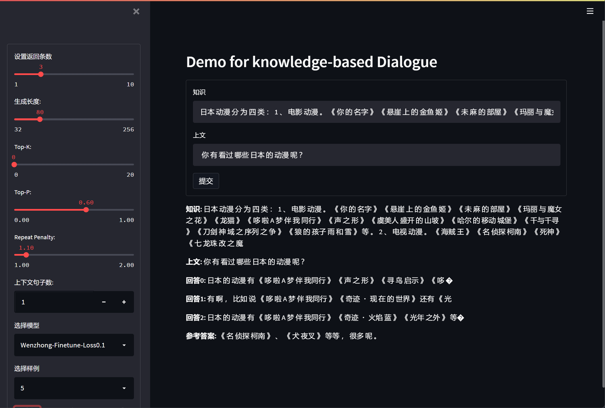

# Demo for Knowledge-based Dialogue

这是一个基于 Streamlit 搭建的多轮对话 Demo，用于展示训练完成的 model 人评估效果。

v1.0
- 实现单轮对话的主体部分
- 实现参数配置的 sidebar

v2.0
- Sidebar 新增载入 dev 数据集样例功能
- Sidebar 新增评估 bleu f1 等得分功能
- 优化 generator 参数

效果如下

